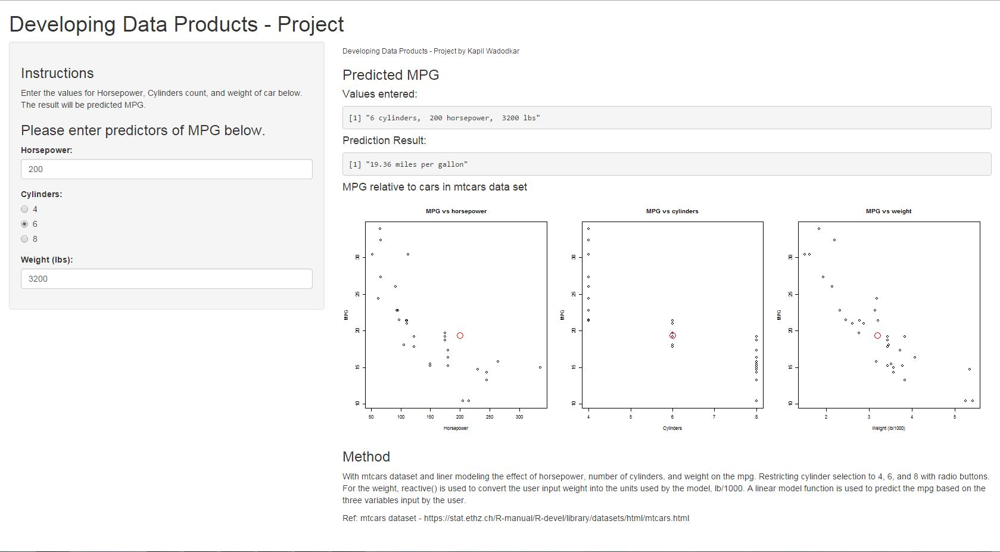

## Problem Background

This is presentation for Shiny app developed as part of title: "Developing Data Products - Project"

This app will help to predict possible MPG against variables like:
- Horsepower
- Cylinders count
- Weight (in lbs)


---

## Dataset in Use - mtcars dataset

The ```mtcars``` dataset can be used to build a model of the effects of car 
characteristics on fuel efficiency.  An example of the data is below:
```{r, results="asis"}
data(mtcars); library(xtable)
print(xtable(mtcars[1:8,]), type = "html")
```

Ref: mtcars dataset - https://stat.ethz.ch/R-manual/R-devel/library/datasets/html/mtcars.html


---

## Methodology used for prediction

With mtcars dataset and liner modeling the effect of 
horsepower, number of cylinders, and weight on the mpg.  Restricting 
cylinder selection to 4, 6, and 8 with radio buttons.  For the weight,
reactive() is used to convert the user input weight into the units 
used by the model, lb/1000.  A linear model function is used to 
predict the mpg based on the three variables input by the user.
```{r}
modelFit <- lm(mpg ~ hp + cyl + wt, data=mtcars)
modelFit$coefficients

mpg <- function(hp, cyl, wt) {
    modelFit$coefficients[1] + modelFit$coefficients[2] * hp + 
        modelFit$coefficients[3] * cyl + modelFit$coefficients[4] * wt
}
```

---

## Application details



User will be providing inputs at left panel.
Output will be provided and will be compared with mtcars data in central panel.